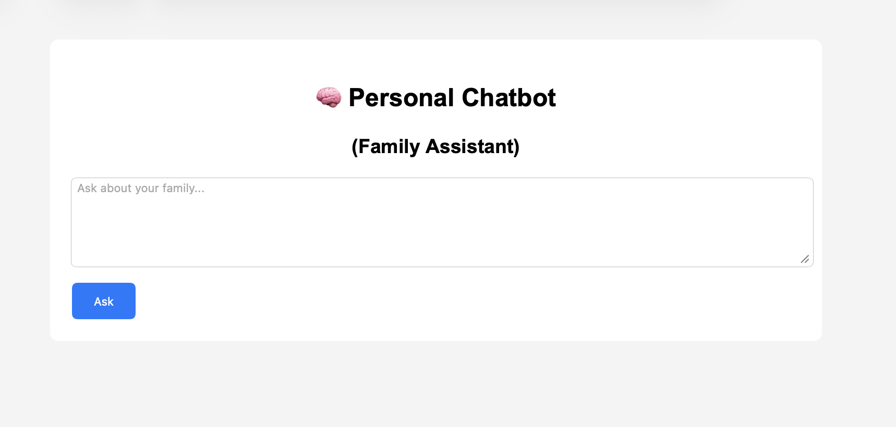
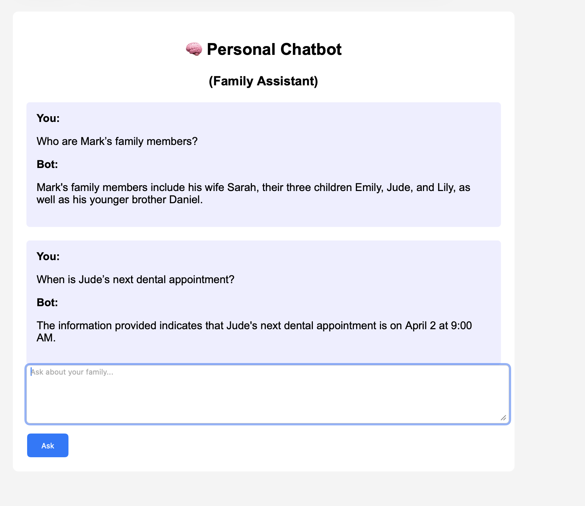
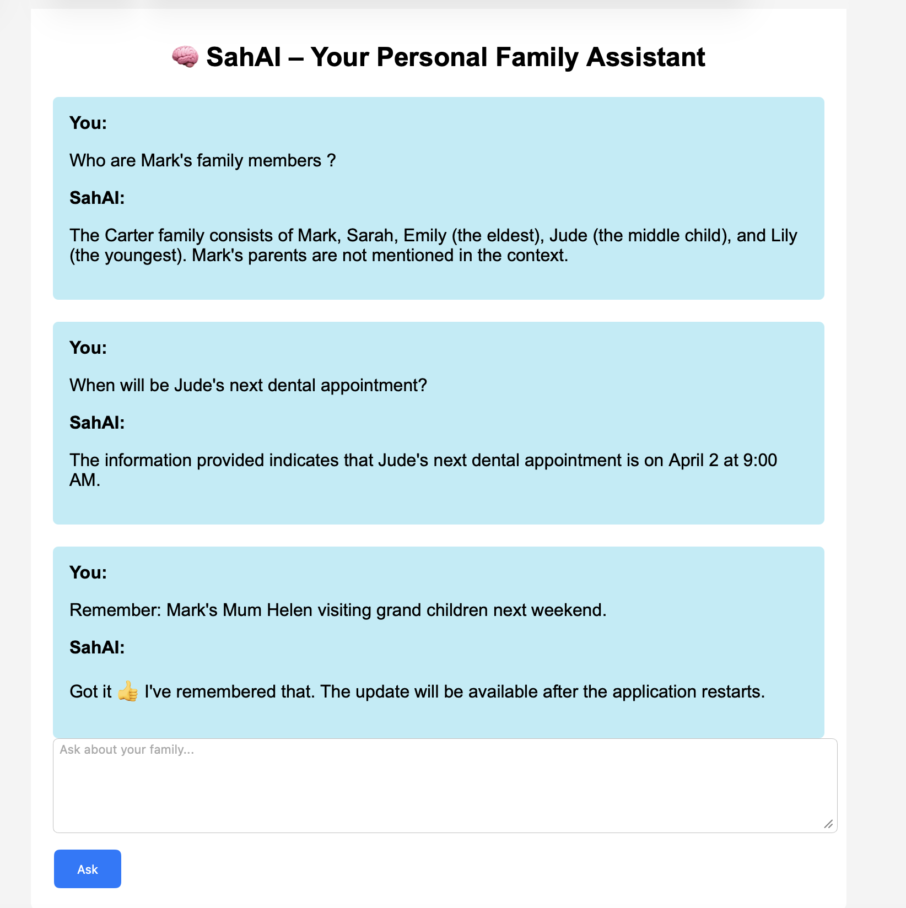

# 🧠 SahAI – Your Personal Family Assistant

This project demonstrates a practical, end-to-end implementation of a local RAG-based assistant.

A **100% local, private Retrieval-Augmented Generation (RAG) chatbot** built using **Ollama**, **LangChain**, **ChromaDB**, and **Flask**.
It acts as a **fictional family personal assistant**, answering questions about family members, appointments, routines, and activities — all **offline** and under your control.


> ⚠️ **Disclaimer**
> All family data used in this project is **entirely artificial and fictional**.
> Any resemblance to real persons, living or dead, or real events is **purely coincidental**.
> This project is for **learning and demonstration purposes only**.

---
## 📸 Screenshots

### Main Interface


### Question & Answer Example


### Remember Command



## ✨ Features

* 🔒 **100% Local** – runs fully offline using Ollama
* 📚 **RAG-based Q&A** – answers only from your documents
* 🧠 **Conversation memory** – remembers chat context
* 🗂️ **Vector search (ChromaDB)** – fast and accurate retrieval
* 🌐 **Web UI** – simple Flask-based interface
* ✍️ **"Remember:" command** – append new facts to knowledge base

---

## 🏗️ Architecture Overview

```
User (Browser)
   ↓
Flask Web App
   ↓
LangChain (Conversational RAG)
   ↓
ChromaDB (Vector Store)
   ↓
Ollama (phi LLM + embeddings)
   ↓
family.txt (Fictional Knowledge Base)
```

---

## 📁 Project Structure

```
rag-chatbot/
├── docs/
│   └── family.txt          # Fictional family knowledge
├── chroma_db/              # Vector database (auto-generated)
├── scripts/
│   └── rag_engine_with_history.py
├── web/
│   ├── app.py              # Flask application
│   └── templates/
│       └── index.html      # Web UI
├── rag-env/                # Python virtual environment
├── requirments.txt
└── README.md
```

---

## 🧰 Requirements

* Python **3.10+**
* Ollama installed and running
* At least **6–8 GB RAM** recommended

### Python packages (installed in venv):

* flask
* langchain
* langchain-community
* langchain-text-splitters
* chromadb

---

## 🚀 Setup Instructions

### 1️⃣ Create & activate virtual environment

```bash
cd /rag-chatbot
python3 -m venv rag-env
source rag-env/bin/activate
```

### 2️⃣ Install dependencies

```bash
pip install -r requirements.txt
```

### 3️⃣ Install & start Ollama

```bash
curl -fsSL https://ollama.com/install.sh | sh
ollama --version
ollama pull phi
ollama pull nomic-embed-text
ollama serve
```

---

## 📄 Knowledge Base

Edit the fictional family data here:

```
docs/family.txt
```

This file contains:

* Family members
* Relationships
* Appointments
* Weekly activities
* Preferences & routines

⚠️ Changes require application restart (by design).

---

## 🧠 RAG Engine

Located at:

```
scripts/rag_engine_with_history.py
```

### Key components:

* **TextLoader** – loads `family.txt`
* **RecursiveCharacterTextSplitter** – chunks text
* **OllamaEmbeddings** – converts text → vectors
* **ChromaDB** – stores vectors
* **ConversationalRetrievalChain** – handles Q&A + memory

---
## 🧠 Start phi before App

```bash
 ollama run phi    
```

## 🌐 Run the Web App

```bash
cd web
/rag-chatbot/rag-env/bin/python3  app.py
```

Open browser:

```
http://<your-ip>:5000
```

---

## 💬 Example Questions

* Who is Mark?
* Who are Mark’s family members?
* When is Jude’s next dental appointment?
* What activities does Lily have this week?


---

## ✍️ "Remember:" Command

You can add new knowledge during chat:

```
Remember: Mark's mother Helen is visiting next weekend
```

✔ Appends to `family.txt`
✔ Acknowledged immediately
⚠️ Becomes searchable **after app restart**

---

## 🔧 Troubleshooting

### 🌀 Model Hallucinations or Inaccurate Responses

If the system starts producing inaccurate or hallucinated responses, it may be due to outdated or inconsistent vector embeddings.

To recover:

1. **Stop the application**
2. **Update the source data**
   - Edit or correct the contents of `family.txt`
3. **Rebuild the vector database**
   ```bash
      rm -rf /rag-chatbot/chroma_db
   ```
4. Restart the application to allow embeddings to be regenerated from the updated data.

This process ensures the vector store remains consistent with the latest source documents.

## 🔐 Security Notes

* Uses `app.secret_key` for Flask session security
* Designed for **local / private use only**
* Do not expose publicly without authentication

---

## 🧠 Limitations (By Design)

* No hot-reload of vector DB (avoids corruption)
* Single-user chat memory
* Fictional data only

---

## 🛣️ Future Improvements

### 🔊 Voice-Based Personal Assistant (Next Level)

A natural next step is to evolve this Flask web app into a **voice-driven personal assistant**.

**Proposed Architecture:**

```
Microphone
   ↓
Speech-to-Text (STT)
   ↓
RAG API (FastAPI instead of Flask)
   ↓
LangChain + ChromaDB + Ollama
   ↓
Text Response
   ↓
Text-to-Speech (TTS)
   ↓
Speaker
```

**Key Changes:**

* Replace Flask UI with **FastAPI** (API-first design)
* Use **Speech-to-Text (STT)** models:

  * Whisper (local)
  * Vosk
* Convert responses to audio using **Text-to-Speech (TTS)**:

  * Piper (local)
  * Coqui TTS
* Run on:

  * Raspberry Pi
  * Mini PC
  * Old laptop

**Result:**
A fully local, privacy-first **personal assistant speaker** — no cloud, no tracking.

---

## 🛣️ More Future Improvements

* Auto-reindex with file locks
* Multi-user sessions
* Streaming responses
* Authentication
* Calendar export (ICS)
* Voice input/output

---

## 🏁 Final Notes

This project is meant as a **learning-friendly, realistic RAG system**, not a production cloud app.

You now have:

* A working local LLM assistant
* Document-grounded answers
* Conversational memory
* Full control over data

🚀 Well done — this is real applied AI engineering.


## 📄 License

This project is licensed under the MIT License.
See the [LICENSE](LICENSE) file for details.
